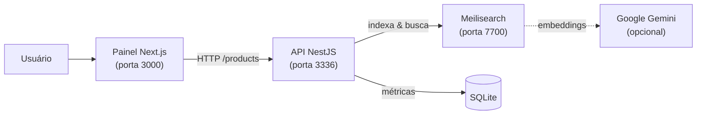

# 🔎 Project Search — Busca Inteligente de Produtos (Fullstack)

Plataforma **fullstack** de busca de produtos com correção de digitação, sinônimos,
filtros avançados e **busca semântica com IA** (busca híbrida). Inclui uma **API**
em NestJS sobre o motor [Meilisearch](https://www.meilisearch.com/) e um **painel
administrativo** em Next.js para testar buscas, gerir sinônimos, configurar o motor
e acompanhar métricas de uso.

> Projeto de portfólio. Não acompanha catálogo de dados — você popula com os seus
> próprios produtos (veja [docs/POVOAMENTO.md](./docs/POVOAMENTO.md)).


---

## ✨ Funcionalidades

- **Busca textual robusta** — tolerância a erros de digitação, ranking por relevância e proximidade.
- **Busca semântica (IA)** — modo híbrido usando embeddings do Google Gemini; entende intenção, não só palavras exatas. Pode ser ligada/desligada em tempo real.
- **Sinônimos gerenciáveis** — cadastre grupos de sinônimos pelo painel (ex.: `celular` ↔ `smartphone`).
- **Filtros avançados** — por marca, categoria, fornecedor, segmento, região e disponibilidade de estoque.
- **Multi-região** — modelo de dados com preço/estoque por região (opcional).
- **Sincronização Smart Upsert** — indexa em lote detectando novos, atualizados e removidos.
- **Métricas de uso** — termos mais buscados e "oportunidades perdidas" (buscas sem resultado) persistidas em SQLite.
- **Painel administrativo** — dashboard, teste de busca ("playground"), gestão de sinônimos e configurações, com tema claro/escuro.

---

## 🏗️ Arquitetura



- **Meilisearch** é o motor de busca (índice `produtos`).
- A **API NestJS** configura o motor (tolerância a erros, ranking, sinônimos, embedders), expõe as rotas de busca/indexação e registra métricas em **SQLite** (via TypeORM).
- O **painel Next.js** consome a API e oferece a interface de administração.
- O **Gemini** é opcional: sem chave, o sistema funciona apenas com busca textual.

---

## 🧰 Stack

| Camada    | Tecnologias                                                            |
| --------- | --------------------------------------------------------------------- |
| Backend   | NestJS 11, TypeScript, TypeORM, SQLite, SDK do Meilisearch            |
| Motor     | Meilisearch                                                           |
| IA        | Google Gemini (embeddings) — opcional                                |
| Frontend  | Next.js 16, React 19, Tailwind CSS 4, shadcn/ui, Recharts            |
| Infra     | Docker + Docker Compose                                               |

---

## 📁 Estrutura do monorepo

```
project-search/
├── backend/            # API de busca (NestJS)
│   ├── src/
│   │   ├── search/     # controller, service, entidades (histórico e config)
│   │   ├── app.module.ts
│   │   └── main.ts
│   ├── data/           # SQLite de métricas (gerado em runtime)
│   ├── Dockerfile
│   └── .env.example
├── frontend/           # Painel administrativo (Next.js)
│   ├── app/            # dashboard, produtos, sinônimos, teste, configurações
│   ├── components/     # UI (shadcn), sidebar, gráficos
│   ├── lib/api.ts      # cliente HTTP da API
│   ├── Dockerfile
│   └── .env.example
├── docs/
│   ├── API.md          # referência das rotas
│   └── POVOAMENTO.md   # como popular o catálogo
├── docker-compose.yml  # orquestra meilisearch + api + web
├── .env.example
└── LICENSE
```

---

## 🚀 Começando

### Opção 1 — Docker Compose (recomendado)

Sobe os três serviços (Meilisearch, API e painel) de uma vez.

```bash
# 1. Copie as variáveis de ambiente
cp .env.example .env         # e ajuste se quiser (chave do Gemini etc.)

# 2. Suba tudo
docker compose up --build
```

Acesse:

- Painel: <http://localhost:3000>
- API: <http://localhost:3336/products/cadastrados>
- Meilisearch: <http://localhost:7700>

### Opção 2 — Desenvolvimento local (sem Docker)

**Pré-requisitos:** Node.js 20+, e um Meilisearch rodando (via Docker abaixo ou binário local).

```bash
# Meilisearch (via Docker)
docker run -it --rm -p 7700:7700 \
  -e MEILI_MASTER_KEY=masterKey \
  getmeili/meilisearch:v1.10
```

**Backend:**

```bash
cd backend
cp .env.example .env
npm install
npm run start:dev        # http://localhost:3336
```

**Frontend:**

```bash
cd frontend
cp .env.example .env
npm install
npm run dev              # http://localhost:3000
```

---

## ⚙️ Variáveis de ambiente

**Backend** (`backend/.env`):

| Variável           | Padrão                  | Descrição                                        |
| ------------------ | ----------------------- | ------------------------------------------------ |
| `PORT`             | `3336`                  | Porta da API                                     |
| `MEILISEARCH_HOST` | `http://localhost:7700` | Endereço do Meilisearch                          |
| `MEILISEARCH_KEY`  | `masterKey`             | Chave mestra do Meilisearch                      |
| `GEMINI_API_KEY`   | —                       | Chave do Google Gemini (habilita a busca por IA) |

**Frontend** (`frontend/.env`):

| Variável              | Padrão                             | Descrição                        |
| --------------------- | ---------------------------------- | -------------------------------- |
| `NEXT_PUBLIC_API_URL` | `http://localhost:3336/products`   | URL base da API (usada no browser) |

> As variáveis `NEXT_PUBLIC_*` são embutidas no bundle durante o build — não coloque segredos nelas.

---

## 📦 Populando o catálogo

O repositório **não inclui produtos**. Para indexar os seus dados, siga o
[Guia de Povoamento](./docs/POVOAMENTO.md) — há exemplos com `curl` e um script
importador em Node.js pronto para adaptar.

Validação rápida após indexar:

```bash
curl http://localhost:3336/products/cadastrados
curl "http://localhost:3336/products/search?termo=camiseta"
```

---

## 📚 API

Referência completa das rotas em [docs/API.md](./docs/API.md). Resumo:

| Método   | Rota                          | Descrição                        |
| -------- | ----------------------------- | -------------------------------- |
| `GET`    | `/products/search`            | Busca principal (vitrine)        |
| `POST`   | `/products/produtos`          | Indexar/atualizar produtos       |
| `GET`    | `/products/cadastrados`       | Listar produtos indexados        |
| `DELETE` | `/products/limpar`            | Limpar o índice                  |
| `POST`   | `/products/sinonimos`         | Cadastrar sinônimos              |
| `GET`    | `/products/metricas`          | Métricas de uso                  |
| `GET`    | `/products/config`            | Ver configuração do motor        |
| `PUT`    | `/products/config/ia`         | Ligar/desligar busca por IA      |

---

## 🧪 Testes

```bash
cd backend
npm test            # testes unitários
npm run test:e2e    # testes end-to-end
```

---

## 📄 Licença

Distribuído sob a licença [MIT](./LICENSE).
